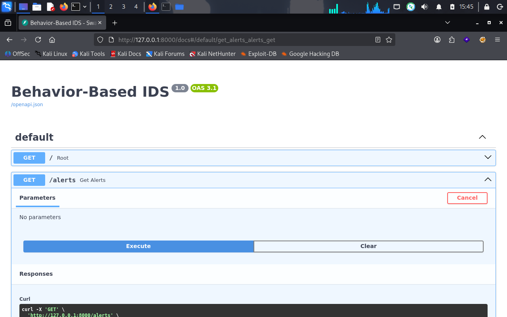

# Behavior-Based Intrusion Detection System (IDS)

A behavioral anomaly detection engine designed to identify malicious network activity by establishing an unsupervised baseline of "normal" host behavior. Unlike traditional Signature-Based IDS (e.g., Snort or Suricata) which rely on known rule matches, this system catches novel zero-day threats and lateral movement tactics by flagrant deviations from a statistically learned network baseline.

---

## 🏗️ System Architecture

The pipeline processes raw, streaming-style event records, engineers state-tracking features, evaluates behavioral patterns using unsupervised machine learning, and exposes a clean alerting interface:

1. **Ingestion Layer:** Simulates high-throughput network flow events (NetFlow/IPFIX format).
2. **Feature Engineering Layer:** Implements sequential time-window aggregations (1-minute buckets per unique host/source IP pair).
3. **Inference Engine:** Leverages an unsupervised **Isolation Forest** model to detect multi-dimensional structural outliers.
4. **Explainability Module:** Translates raw anomaly scores into human-readable tactical explanations for security analysts.
5. **API Presentation Layer:** Extends a high-performance FastAPI wrapper to facilitate seamless integration with SIEM platforms.

---

## 📊 Feature Design Rationale

To defeat adversarial evasion techniques, the system tracks the structural metadata of a connection rather than volatile Indicators of Compromise (IoCs) like explicit IP addresses or domain names.

| Feature Name | Analytical Intent & Defense Context |
| :--- | :--- |
| `connections` | Tracks baseline velocity. Sudden spikes point to DoS/DDoS or automated horizontal brute-forcing. |
| `unique_ports` | Monitors network reconnaissance. Rapid distinct port utilization reveals vertical scanning profiles. |
| `bytes_mean` / `bytes_sum` | Profiles exfiltration or payload signatures. Excessively low averages signal C2 heartbeats or rapid scanning; huge spikes reveal active data staging and theft. |
| `duration_mean` | Evaluates interactive session properties. Nanosecond durations indicate rapid scanning scripts; unusually prolonged sessions imply persistent interactive reverse shells. |

---

## 🤖 Machine Learning Model & Tuning

### Why Isolation Forest?
Traditional distance- or density-based clustering models (like K-Means or DBSCAN) focus on mapping dense normal clusters, scaling poorly ($O(N^2)$) in production. Isolation Forest explicitly isolates anomalies instead of profiling normal points. 

By randomly partitioning feature spaces through random cuts, anomalies require significantly fewer structural splits to isolate and appear much closer to the root of the decision trees. This gives it a highly efficient runtime complexity of $O(N)$.

### The Contamination Parameter
The model uses a hyperparameter configuration of `contamination=0.05` (5%). 
* **Too High:** Overly aggressive modeling captures routine infrastructure spikes, overwhelming a SOC team with false positives.
* **Too Low:** Shakes off stealthy, slow-moving attacks (low-and-slow exfiltration) by absorbing the malicious signals directly into the "normal" behavioral cluster boundary.

---

## 🖥️ API & Analytics Dashboard

The system exposes an interactive Swagger UI portal allowing tier-1 security analysts to quickly inspect active telemetry, query data models, and drill down into algorithmic classifications.

### Interactive API Sandbox
Below is the live operational testing environment displaying the exposed backend endpoints:



### Production Threat JSON Output
When hitting the `/alerts` endpoint, the model outputs structured security telemetry:

```json
[
  {
    "host": "srv-web-01",
    "src_ip": "198.51.100.10",
    "window": "2026-05-27T14:06:00+00:00",
    "connections": 300,
    "unique_ports": 3,
    "bytes_mean": 118.4,
    "bytes_sum": 35520,
    "duration_mean": 0.105,
    "anomaly_score": -0.2415,
    "anomaly": true,
    "explanations": "Low average byte transfers (Typical of scanning/probing); Potential Port Scan"
  }
]
⚠️ Real-World Limitations & Mitigations
Concept Drift: Legitimate shifts in corporate network behavior (such as new software deployments or scheduled server maintenance) can masquerade as anomalies.

Mitigation: Implement automated rolling retraining pipelines using continuous data loops (via Apache Airflow or MLflow) to update the baseline dynamically.

Data Poisoning: If an attacker executes incredibly slow, low-volume scanning techniques during the initial model baseline training phase, the Isolation Forest will categorize the threat actor as "normal" user behavior.

Mitigation: Seed the baseline strictly during pre-audited, verified clean windows of enterprise operation.

🚀 Quickstart Guide
1. Installation & Environment Setup
Clone the repository and install all locked dependencies inside an isolated virtual environment:

Bash
git clone [https://github.com/](https://github.com/)<your-username>/behavior-based-ids.git
cd behavior-based-ids
python -m venv .venv
source .venv/bin/activate
pip install -r requirements.txt
2. Run the End-to-End Analytics Pipeline
Execute data generation, structural feature transformation, training, and static inference processing in sequence:

Bash
python src/data/generate_flows.py && \
python src/features/build_features.py && \
python src/models/train.py && \
python src/detection/detect.py
3. Launch the API Service
Expose the detection engine to your local network using the virtual environment's web server engine:

Bash
.venv/bin/uvicorn src.api.app:app --reload --port 8000
Navigate to http://127.0.0.1:8000/ in your browser to interact with the API interface.


***

### 💡 Pro-Tip for your GitHub Repo:
1. In your project directory, create a folder for images: `mkdir -p docs/images`
2. Save your browser screenshot inside that folder as `swagger_ui.png`.
3. When someone opens your GitHub profile, the image will automatically render beautifull
